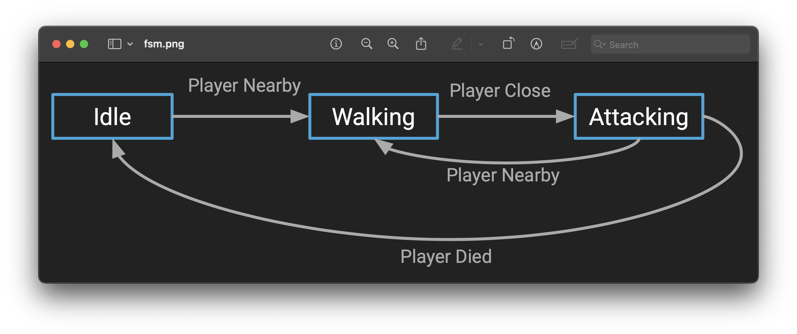
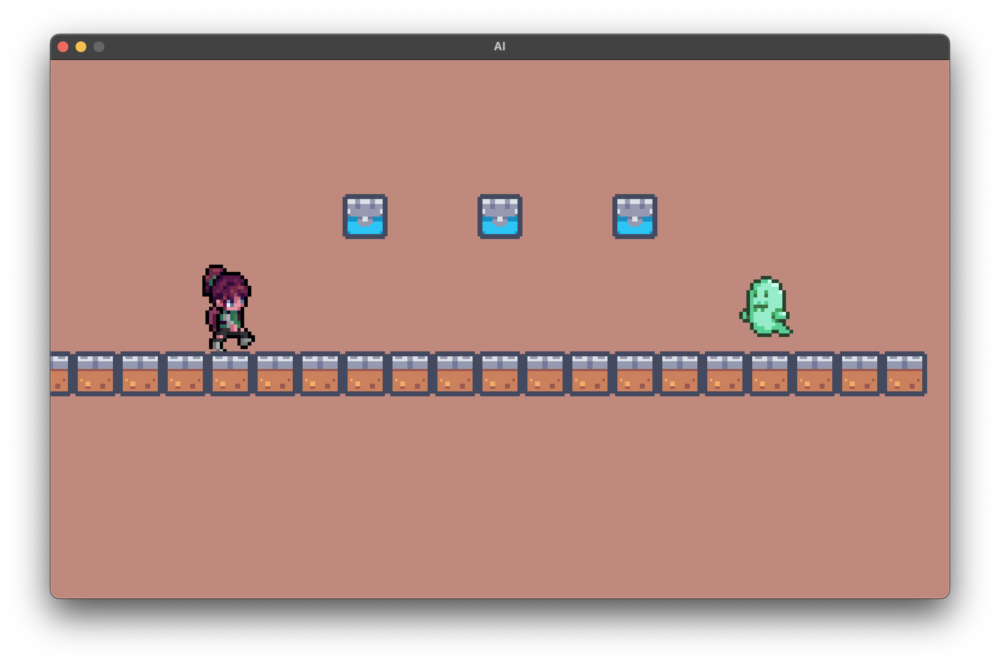
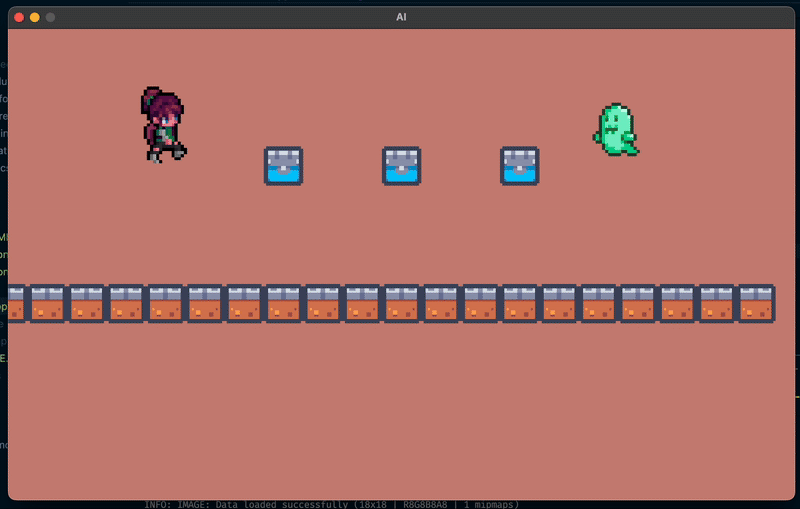
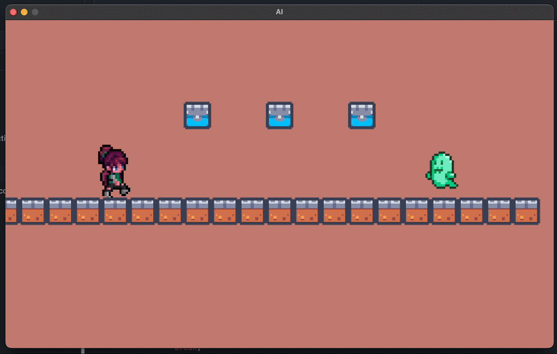

 <h2 align=center>Week 07</h2>

<h1 align=center>AI In Games</h1>

<h3 align=center>XVII Wyvern Moon, Imperial Year MMXXV</h3>

<p align=center>
    <strong>
        <em>
            Song of the day:
        </em>
    </strong>
    <br>
    <em>
        <a href="https://youtu.be/o4OsvOqHnZM?si=q5miSLLIZQdDAmoe">
            <strong>
                ムリムリ進化論 (No Way No Way Evolutionary Theory)
            </strong>
        </a> by ナナヲアカリ (Nanaoakari) (2025)
    </em>
</p>

---

## Sections

1. [**Game State**](#1)
2. [**Is AI in games real AI?**](#2)
3. [**AI Types and States**](#3)
4. [**Wandering Behaviour**](#4)
5. [**Follower Behaviour**](#5)
6. [**Audio: Feedback, Environment, and Mood**](#6)
    1. [**Initializing the Audio System**](#6-1)
    2. [**Playing Background Music**](#6-2)
    3. [**Playing Background Music**](#6-3)
    4. [**Playing Sound Effects**](#6-4)

---

<a id="1"></a>

## Game State

A quick, minor housecleaning change:

We're getting to a point in the complexity of our games where each of our levels all share the same core "structure" and "ingredients"—stuff like the player object, the enemies, the map, the background music, etc.. Optimally, we wanna have all these important things in one place, as they are all part of the game's current **state**. For that reason (and because we'll be actually be making _separate levels_ in a couple of weeks), it's a good idea to place these structures inside of a data structure in our `main` file. For now, a good old simple `struct` will do:

```cpp
// main.cpp

// ...
struct GameState
{
    Entity *xochitl;
    Entity *tiles;
    Entity *blocks;
};
// ...
GameState gState;
// ...
```

Of course, this now requires us to access everything from our variable `gState` instead, but that's not much of an issue:

```cpp
void initialise()
{
    // ...

    // Assets from @see https://sscary.itch.io/the-adventurer-female
    gState.xochitl = new Entity(
        {ORIGIN.x - 300.0f, ORIGIN.y - 200.0f}, // position
        {250.0f * sizeRatio, 250.0f},           // scale
        "assets/game/walk.png",                 // texture file address
        ATLAS,                                  // single image or atlas?
        ATLAS_DIMENSIONS,                       // atlas dimensions
        xochitlAnimationAtlas,                  // actual atlas
        PLAYER                                  // entity type
    );

    gState.xochitl->setJumpingPower(450.0f);
    gState.xochitl->setColliderDimensions({
        gState.xochitl->getScale().x / 3.0f,
        gState.xochitl->getScale().y / 3.0f
    });
    gState.xochitl->setAcceleration({0.0f, ACCELERATION_OF_GRAVITY});

    /*
        ----------- TILES -----------
    */
    gState.tiles = new Entity[NUMBER_OF_TILES];

    // Compute the left‑most x coordinate so that the entire row is centred
    float leftMostX = ORIGIN.x - (NUMBER_OF_TILES * TILE_DIMENSION) / 2.0f;

    for (int i = 0; i < NUMBER_OF_TILES; i++) 
    {
        // @see https://kenney.nl/assets/pixel-platformer-industrial-expansion
        gState.tiles[i].setTexture("assets/game/tile_0000.png");
        gState.tiles[i].setEntityType(PLATFORM);
        gState.tiles[i].setScale({TILE_DIMENSION, TILE_DIMENSION});
        gState.tiles[i].setColliderDimensions({TILE_DIMENSION, TILE_DIMENSION});
        gState.tiles[i].setPosition({
            leftMostX + i * TILE_DIMENSION, 
            ORIGIN.y + TILE_DIMENSION
        });
    }

    /*
        ----------- BLOCKS -----------
    */
    gState.blocks = new Entity[NUMBER_OF_BLOCKS];

    for (int i = 0; i < NUMBER_OF_BLOCKS; i++) 
    {
        // @see https://kenney.nl/assets/pixel-platformer-industrial-expansion
        gState.blocks[i].setTexture("assets/game/tile_0061.png");
        gState.blocks[i].setEntityType(BLOCK);
        gState.blocks[i].setScale({TILE_DIMENSION, TILE_DIMENSION});
        gState.blocks[i].setColliderDimensions(
            {TILE_DIMENSION, TILE_DIMENSION});
    }

    gState.blocks[0].setPosition(
        {ORIGIN.x - TILE_DIMENSION * 3, ORIGIN.y - TILE_DIMENSION * 2.5f});
    gState.blocks[1].setPosition(
        {ORIGIN.x, ORIGIN.y - TILE_DIMENSION * 2.5f});
    gState.blocks[2].setPosition(
        {ORIGIN.x + TILE_DIMENSION * 3, ORIGIN.y - TILE_DIMENSION * 2.5f});

    // ...
}

void processInput() 
{
    gState.xochitl->resetMovement();
    gState.ghost->resetMovement();

    if      (IsKeyDown(KEY_A)) gState.xochitl->moveLeft();
    else if (IsKeyDown(KEY_D)) gState.xochitl->moveRight();

    if (IsKeyPressed(KEY_W) && gState.xochitl->isCollidingBottom())
    {
        gState.xochitl->jump();
    }

    // to avoid faster diagonal speed
    if (GetLength(gState.xochitl->getMovement()) > 1.0f) 
        gState.xochitl->normaliseMovement();

    // ...
}

void update() 
{
    // ...

    while (deltaTime >= FIXED_TIMESTEP)
    {
        gState.xochitl->update(FIXED_TIMESTEP, nullptr, gState.tiles, 
            NUMBER_OF_TILES, gState.blocks, NUMBER_OF_BLOCKS);

        for (int i = 0; i < NUMBER_OF_BLOCKS; i++) 
            gState.blocks[i].update(FIXED_TIMESTEP, nullptr, nullptr, 0, 
                nullptr, 0);

        for (int i = 0; i < NUMBER_OF_TILES; i++) 
            gState.tiles[i].update(FIXED_TIMESTEP, nullptr, nullptr, 0, 
                nullptr, 0);

        deltaTime -= FIXED_TIMESTEP;
    }

    if (gState.xochitl->getPosition().y > END_GAME_THRESHOLD) 
        gAppStatus = TERMINATED;
}

void render()
{
    // ...

    gState.xochitl->render();

    for (int i = 0; i < NUMBER_OF_TILES;  i++) gState.tiles[i].render();
    for (int i = 0; i < NUMBER_OF_BLOCKS; i++) gState.blocks[i].render();

    // ...
}

void shutdown() 
{
    delete   gState.xochitl;
    delete[] gState.tiles;
    delete[] gState.blocks;

    // ...
}

// ...
```

Okay, let's move on to our first topic of the day.

<br>

<a id="2"></a>

## Is AI in games real AI?

Most of the times, the answer to this question is _no. It isn't_. Strictly speaking, we would only ever be able to call AI in games _actual_ artificial intelligence if and only if it had any sort of emergent behaviour powered by some sort of machine learning model. While this is certainly something that may be possible within our lifetimes, the games that we know and love right now don't have—and indeed, don't _need_—machine learning in order to be fun and immersive. So, what are they using instead?

If you study a bit theoretical computer science, you'll eventually come across something called a [**finite state machine**](https://en.wikipedia.org/wiki/Finite-state_machine) (FSM). To paraphrase the concept, a FSM is a theoretical machine that has a very specific set of actions. It can only perform actions contained in this set, and it changes from action to action depending on external conditions. A common example of an FSM is a traffic light—it only performs a very specific set of actions, and it changes between those actions depending on the traffic situation.

The following example might be more so in our purview:

<a id="fg-1"></a>

<p align=center>
    
    </img>
</p>

<p align=center>
    <sub>
        <strong>Figure I</strong>: An FSM with three possible states.
    </sub>
</p>

In other words, our enemy/NPC (non-playable character) AI are simply going to be `Entity` objects that will react to outside stimuli and _switch states_ depending on the circumstances.

<br>

<a id="3"></a>

## AI Types and States

You might remember from [**exercise 5**](https://github.com/sebastianromerocruz/CS-3113-Intro-To-Game-Programming/tree/main/exercises/05-physics#week-06) that we added a new attribute to our `Entity` class: `EntityType`. We'll expand that enum now by adding an `NPC` option, which will serve as our demonstrative AI type:

```c++
// Entity.h
enum EntityType { PLAYER, BLOCK, PLATFORM, NPC, NONE };
```

Our next step after that is to give our class the following two attributes:

1. **`mAIType`**: An enum that will determine what kind of behaviour this `Entity` will do. This could be anything from a simply walker, a guard, a follower, etc..
2. **`mAIState`**: This enum corresponds to our [**FSM from earlier**](#fg-1). Depending on the condition around the `Entity` object, it will switch between the values of this enum.

```cpp
// Entity.h

// ...
enum AIType  { WANDERER, FOLLOWER       };
enum AIState { WALKING, IDLE, FOLLOWING };

class Entity
{
private:
    // ...
    AIType  mAIType;
    AIState mAIState;
    // ...
public:
    // ...
    AIType  getAIType()  const { return mAIType;  }
    AIState getAIState() const { return mAIState; }
    // ...
    void setAIState(AIState newState)
        { mAIState = newState; }
    void setAIType(AIType newType)
        { mAIType  = newType;  }
};
```

Now, to start implementing some AI behaviour, let's initialise an [**cute lil ghost**](lectures/07-ai/assets/game/gosth.png) I found on [**itch.io**](dyru.itch.io/pixel-ghost-template):

```cpp
// main.cpp

// ...
struct GameState
{
    // ...
    Entity *ghost;
};

// ...

void initialise()
{
    // ...

    std::map<Direction, std::vector<int>> ghostAnimationAtlas = {
        {LEFT,  { 1, 9, 17, 25 }},
        {RIGHT, { 0, 8, 16, 24 }},
    };

    // @see dyru.itch.io/pixel-ghost-template
    gState.ghost = new Entity(
        {ORIGIN.x + 300.0f, ORIGIN.y - 200.0f}, // position
        {100.0f, 100.0f},                       // scale
        "assets/game/gosth.png",                // texture file address
        ATLAS,                                  // single image or atlas?
        ATLAS_DIMENSIONS,                       // atlas dimensions
        ghostAnimationAtlas,                    // actual atlas
        NPC                                     // entity type
    );

    gState.ghost->setAIType(WANDERER);
    gState.ghost->setAIState(IDLE);
    gState.ghost->setSpeed(Entity::DEFAULT_SPEED * 0.50f);

    gState.ghost->setColliderDimensions({
        gState.ghost->getScale().x / 2.0f,
        gState.ghost->getScale().y
    });

    gState.ghost->setAcceleration({0.0f, ACCELERATION_OF_GRAVITY});
    gState.ghost->setDirection(LEFT);
    gState.ghost->render(); // calling render once at the beginning to switch ghost's direction

    // ...
}

// ...

void update() 
{
    // ...

    while (deltaTime >= FIXED_TIMESTEP)
    {
        // ...

        gState.ghost->update(FIXED_TIMESTEP, gState.xochitl, gState.tiles, 
            NUMBER_OF_TILES, gState.blocks, NUMBER_OF_BLOCKS);

        // ...
    }

    // ...
}

void render()
{
    // ...

    gState.ghost->render();
    
    // ...
}

void shutdown() 
{
    // ...
    delete gState.ghost;
    // ....
}
```

<a id="fg-2"></a>

<p align=center>
    
    </img>
</p>

<p align=center>
    <sub>
        <strong>Figure II</strong>: It's October, after all.
    </sub>
</p>

<br>

<a id="4"></a>

## Wandering Behaviour

Not a lot goes into this particular kind of NPC, since all they're doing is walking forward in any given direction. Still, let's take advantage of that simplicity to set up a structure that will allow us to _activate_ any time AI type from here on out. The plan is as follows:

1. In our `Entity` class's `update`, activate AI behaviour in general _if_ the type of this entity is `NPC`.
2. Depending on the type of _AI_ this entity is, we'll then call a method specific to only that type of AI.

So, it sounds like we need two methods:

```cpp
// Entity.h

// ...
class Entity
{
private:
    // ...

    void AIActivate(Entity *target);
    void AIWander();

    // ...
};
```
```cpp
// Entity.cpp

// ...

void Entity::AIActivate()
{
    switch (mAIType)
    {
    case WANDERER:
        AIWander();
        break;

    case FOLLOWER:
        break;
    
    default:
        break;
    }
}

// ...

void Entity::AIWander() { moveLeft(); } // super simple!

void Entity::update(float deltaTime, Entity *collidableEntities, 
    int collisionCheckCount, Entity* blocks, int blockCount)
{
    if (mEntityStatus == INACTIVE) return;
    
    if (mEntityType == NPC) AIActivate();

    // ...
}

// ...
```

Recall that `moveLeft()`:

1. Sets the `x` component of the movement vector to `-1` and...
2. Changes the animation `Direction` to `LEFT`.

Now, set the ghost's AI state to `WALKING` when instantiating it in `main()`:

```cpp
// main.cpp

// ...

void initialise()
{
    // ...

    gState.ghost->setAIState(WALKING);

    // ...
}

// ...
```

And lo!

<a id="fg-3"></a>

<p align=center>
    
    </img>
</p>

<p align=center>
    <sub>
        <strong>Figure III</strong>: Perhaps not too exciting, but it's a start!
    </sub>
</p>

<br>

<a id="5"></a>

## Follower Behaviour

The whole point of AI is, of course, to make it reactive to outside stimuli, and what better stimulus to react to than our player? Let's make a new type of AI that will start _following_ the player if it gets too close. Let's call it a `FOLLOWER`. So, let's make this our goal:

```cpp
// Entity,h

enum AIType  { WANDERER, FOLLOWER       };
enum AIState { WALKING, IDLE, FOLLOWING };
```

1. The NPC, by default, will be idle i.e. it will not be moving or doing anything else.
2. If our player gets too close to the NPC (say, a distance less than `250.0f`), the NPC will switch to walking mode.
3. Until the player is outside of the detection range, the NPC will walk towards the player, "following" them.

Now, in order for our AI `Entity` objects to actually know where our player `Entity` object is, they need to actually have access to it. This means that we're going to have to expand our `update` method's signature once more so that we can pass in our player object (I know it's getting a little long. Don't worry, we'll fix it soon). We'll also need to pass our player as the "target" of both `AIActivate` and our new `AIFollow` methods:

```cpp
// Entity.h

// ...

class Entity
{
public:
    // ...

    void AIActivate(Entity *target);
    void AIFollow(Entity *target);

    // ...
public:
    // ...
    void update(float deltaTime, Entity *player, Entity *collidableEntities, 
        int collisionCheckCount, Entity* blocks, int blockCount);
    // ...
};
```
```cpp
// Entity.cpp

// ...
void Entity::AIFollow(Entity *target)
{
    switch (mAIState)
    {
    case IDLE:
        // If the player approaches...
        if (Vector2Distance(mPosition, target->getPosition()) < 250.0f) 
            // Switch to walking
            mAIState = WALKING;
        break;

    case WALKING:
        // Depending on where the player is in respect to their x-position
        // Change direction of the NPC
        if (mPosition.x > target->getPosition().x) moveLeft();
        else                                       moveRight();
    
    default:
        break;
    }
}

void Entity::AIActivate(Entity *target)
{
    switch (mAIType)
    {
    case WANDERER:
        AIWander();
        break;

    case FOLLOWER:
        AIFollow(target);
        break;
    
    default:
        break;
    }
}

void Entity::update(float deltaTime, Entity *player, Entity *collidableEntities, 
    int collisionCheckCount, Entity* blocks, int blockCount)
{
    // ...
    
    if (mEntityType == NPC) AIActivate(player);
    
    // ...

}
```

Change the type of AI in `main`...

```cpp
// main.cpp

// ...

void initialise()
{
    // ...

    gState.ghost->setAIType(FOLLOWER);
    gState.ghost->setAIState(IDLE);

    // ...
}
```

<a id="fg-4"></a>

<p align=center>
    
    </img>
</p>

<p align=center>
    <sub>
        <strong>Figure IV</strong>: I T F O L L O W S.
    </sub>
</p>

<br>

<a id="6"></a>

## Audio: Feedback, Environment, and Mood

One of the unsung heroes of video game development is sound design. What started out as simple beeps and boops in games like [**Pong**](https://youtu.be/e4VRgY3tkh0) and an endlessly repeating background music track in [**Super Mario Bros**](https://youtu.be/-avspZlbOWU?t=13) has evolved into a dynamic and essential part of the game itself. For example, in games like [**Celeste**](https://youtu.be/gXJT9wgu7Wg) the background track of almost every level will dynamically change as you progress through the map, whether it be by growing in intensity or getting calmer. This is, of course, only one example. Many video games with multiple characters will have distinct sound effects for each of them, as can be seen in [**Overwatch**](https://youtu.be/teun_wZ8_LI).

But it can go even deeper than that. Many of us have fond memories of playing rhythm games like [**Dance Dance Revolution**](https://youtu.be/sv7gxqEhcBo?t=68) and [**Cytus**](https://youtu.be/RKP4R_HwyNE)–both of which rely on mechanics entirely based on sound a music. The game [**DubWars**](https://youtu.be/VJFi3gI7j6w)'s gameplay consists entirely of the player having different abilities depending on the music. Sounds design is often an entire class or sets of classes in majors like film and music composition, and for good reason. Of course, we'll only scratch the surface of it in this class, but coming up with clever mechanics based on music can make a game with a simple visual design appear much more complex and polished.

There are plenty of online sources from which you can pull royalty-free [**music**](https://incompetech.filmmusic.io/search/) and [**sound**](https://freesound.org) from, by the way. Don't pay for anything unless you absolutely need/want to!

Perfect — you’ve already set up a wonderfully complete example of how sound and music work together inside a Raylib game. Let’s pick up right where your lecture text left off (“Don’t pay for anything unless you absolutely need/want to!”) and smoothly transition into a guided, student-friendly explanation of how to integrate **music and sound effects** in Raylib — using your code as the running example.

So, how do we get from downloading a `.wav` file to hearing it play in our game world? In Raylib, **sound** and **music** are handled slightly differently—but both are super easy to set up.

<a id="6-1"></a>

### Initializing the Audio System

Before we can load or play *any* audio, we must initialize Raylib’s audio subsystem:

```cpp
// ...
void initialise()
{
    // ...
    InitAudioDevice();
    // ...
}
// ...
```

This function sets up the hardware interface between Raylib and your computer’s audio system.
You should always call this **once** at the start of your program (typically inside your `initialise()` function).
When your game ends, we’ll later call `CloseAudioDevice()` to shut it down cleanly.

<a id="6-2"></a>

### Playing Background Music

Music in Raylib is handled through the `Music` type, which is designed for **streaming long audio files** (like background tracks).

Why? Because unlike sound effects, which are small and can fit entirely in memory, background music is typically several megabytes long. Streaming means only small chunks are read into memory at a time, which is much more efficient:

```cpp
// ...
void initialise()
{
    // ...
    gState.bgm = LoadMusicStream("assets/game/04 - Silent Forest.wav");
    SetMusicVolume(gState.bgm, 0.33f);
    PlayMusicStream(gState.bgm);
    // ...
}
// ...
```

- `LoadMusicStream()` reads your `.wav` file and prepares it for streaming.
- `SetMusicVolume()` adjusts how loud it plays (from `0.0f` to `1.0f`). In our code, we’re setting it to 33% of the maximum volume.
- `PlayMusicStream()` starts the playback.

Unlike `PlaySound()`, the `Music` type needs to be **manually updated** every frame.
That’s why in your `update()` method you call:

```cpp
// ...
void update()
{
    // ...
    UpdateMusicStream(gState.bgm);
    // ...
}
// ...
```

This tells Raylib to stream the next chunk of the music file—keeping playback smooth and continuous. If you forget to call this each frame, the background music will stop after a short time.

When your game shuts down, you free up memory with:

```cpp
void shutdown()
{
    // ...
    UnloadMusicStream(gState.bgm);
    CloseAudioDevice();
    // ...
}
```

<a id="6-3"></a>

### Playing Sound Effects

Sound effects use the `Sound` type in Raylib. Unlike `Music`, sounds are short, so they’re fully loaded into memory when the game starts. That means that they can play immediately without any delay.

In your code, for example:

```cpp
// ...
void initialise()
{
    // ...
    gState.jumpSound = LoadSound("assets/game/Dirt Jump.wav");
    // ...
}
// ...
```

This loads the sound file once and keeps it in memory. Then, every time the player jumps, you play it instantly with:

```cpp
void processInput()
{
    if (IsKeyPressed(KEY_W) && gState.xochitl->isCollidingBottom())
    {
        gState.xochitl->jump();
        PlaySound(gState.jumpSound);
    }
}
```

The function `PlaySound()` can be called multiple times in quick succession—for example, if the player double-jumps or if multiple sound effects overlap.

When cleaning up, make sure to unload it like this:

```cpp
void shutdown()
{
    // ...
    UnloadSound(gState.jumpSound);
    // ...
}
```

Raylib provides a few other [**handy audio functions**](https://www.raylib.com/cheatsheet/cheatsheet.html) that you might want to try:

- **`PauseMusicStream(music);`**: Temporarily pause the background track.
- **`ResumeMusicStream(music);`**: Continue from where you left off.
- **`StopMusicStream(music);`**: Stop the current music entirely.
- **`SetSoundVolume(sound, 0.5f);`**: Change the volume of a single sound effect.
- **`IsSoundPlaying(sound);`**: Check if a sound is still playing (useful for avoiding overlap).

For example, if you wanted to fade music out when the player loses:

```cpp
float volume = 0.33f;

while (volume > 0.0f) 
{
    volume -= 0.01f;
    SetMusicVolume(gState.bgm, volume);
    UpdateMusicStream(gState.bgm);
}
```