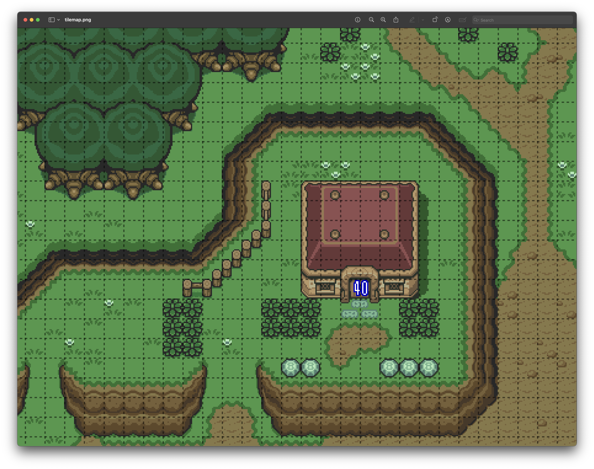
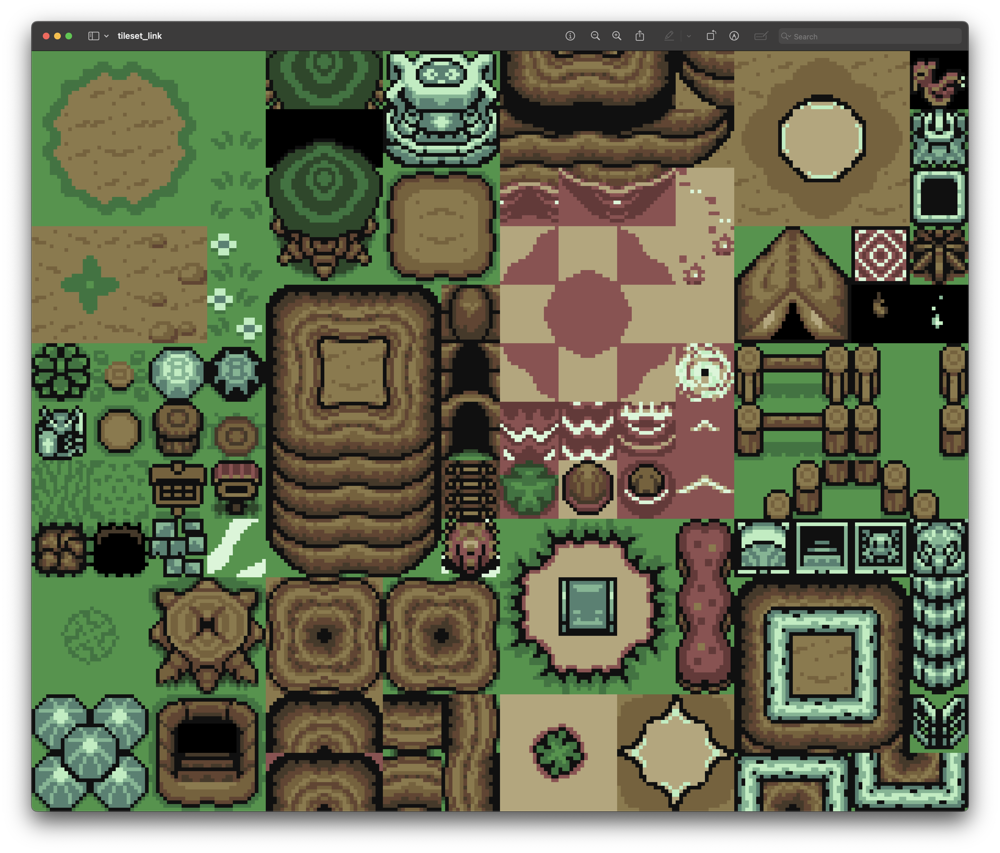
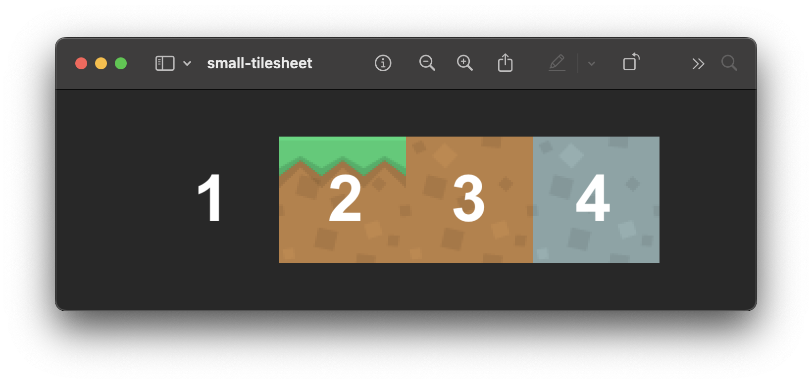
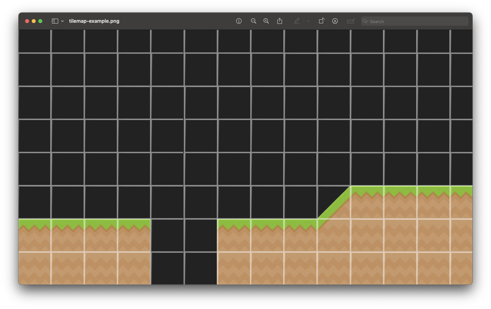
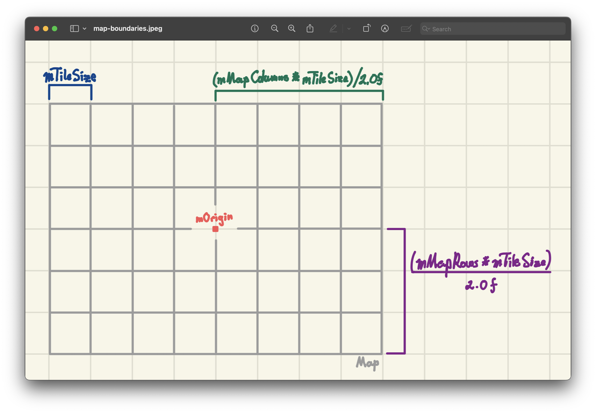
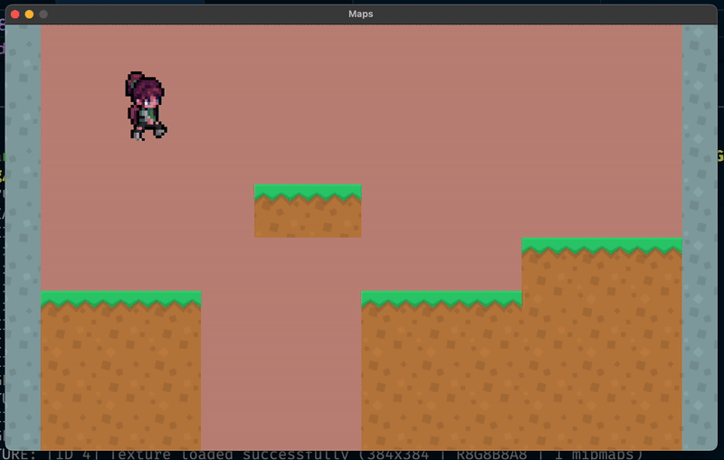
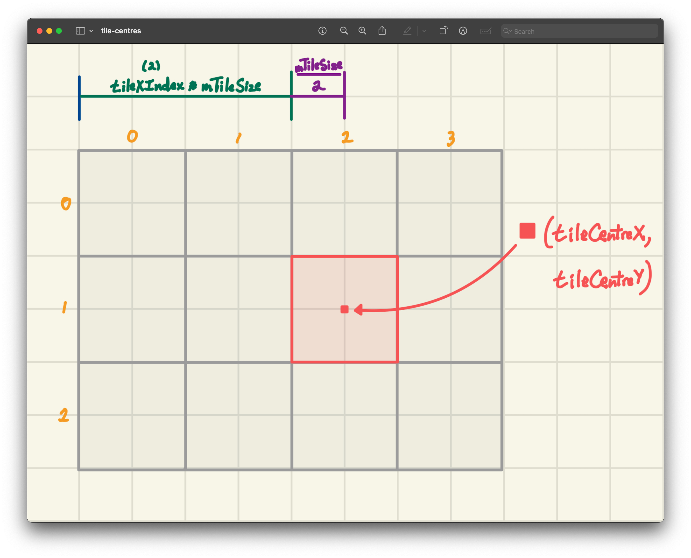
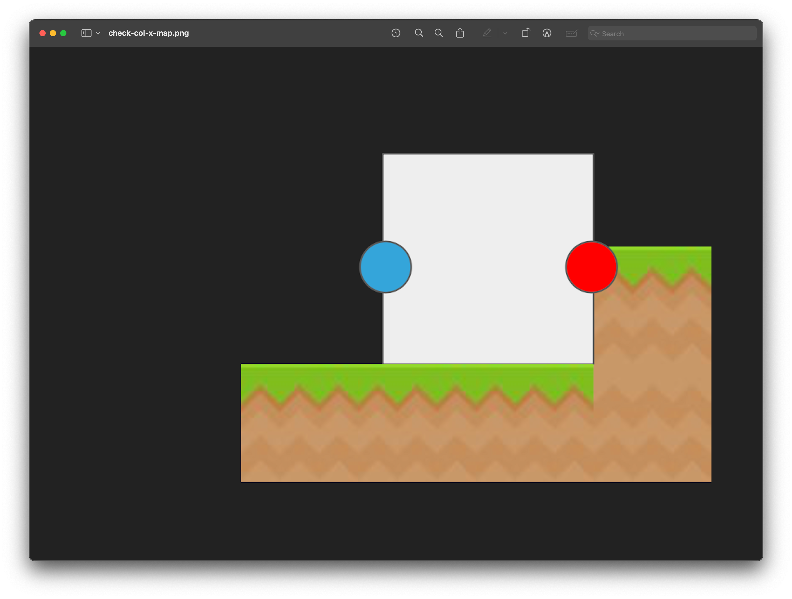
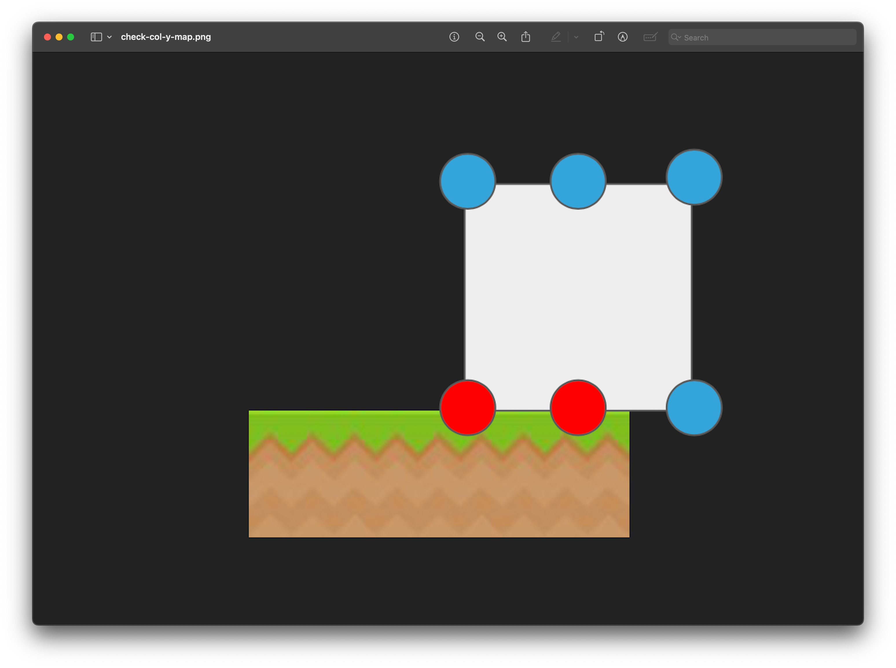
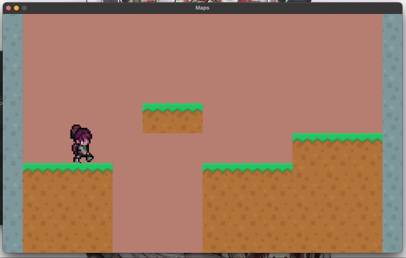

 <h2 align=center>Week 07</h2>

<h1 align=center>Maps</h1>

<h3 align=center>XXIV Wyvern Moon, Imperial Year MMXXV</h3>

<p align=center><strong>Songs of the day</strong>:</p>
<p align=center>
    <em>
        <a href="https://youtu.be/LLjfal8jCYI?si=3kiesvsnz77Vutpe">
            <strong>
                オーバーライド (Override feat. Kasane Teto)
            </strong>
        </a> by 吉田夜世 (Yoshida Yasei; 2023), recommended by Perry Huang
    </em>
</p>
<p align=center>
    <em>
        <a href="https://youtu.be/qQzdAsjWGPg?si=-uf57iQaZ5ItYpWG">
            <strong>
                My Way
            </strong>
        </a> by Frank Sinatra (1969), recommended by Quang Nguyen
    </em>
</p>
<p align=center>
    <em>
        <a href="https://youtu.be/ZHwVBirqD2s?si=VCr6kYYe7a_f4PX9">
            <strong>
                I'm Still Standing
            </strong>
        </a> by Elton John (1983), recommended by Natt Hong
    </em>
</p>

---

## Sections

1. [**Our Next Optimisation**](#1)
2. [**The `Map` Class**](#2)
    1. [**The Grid System**](#2-1)
    2. [**Attributes**](#2-2)
    3. [**Methods**](#2-3)
        - [**Constructor and Destructor**](#2-3-1)
        - [**`build`**](#2-3-2)
        - [**`render`**](#2-3-3)
        - [**`isSolidTileAt`**](#2-3-4)
3. [**Overloading The `Entity` Class's `checkCollisionX` & `checkCollisionY` Methods**](#3)
4. [**Cameras in raylib**](#4)

---

<a id="1"></a>

## Our Next Optimisation

We've been, throughout the semester, constantly optimising the structures that we introduce. The `Entity` class allowed for amazing encapsulation when creating game objects. It is, in other words, a data structure that helps abstract away a lot of the work that repeats in game design patterns. So what is next in our optimisations? So far, our map building scheme looks a bit inefficient. 

For example, to build a _single_, simple platform, we did the following not too long ago:

```c++
// main.cpp

// ...

struct GameState
{
    // ...
    Entity *tiles;
    // ...
};

// ...

constexpr int   NUMBER_OF_TILES = 20;
constexpr float TILE_DIMENSION  = 50.0f;

// ...

void initialise()
{
    // ...

    gState.tiles = new Entity[NUMBER_OF_TILES];

    // Compute the left‑most x coordinate so that the entire row is centred
    float leftMostX = ORIGIN.x - (NUMBER_OF_TILES * TILE_DIMENSION) / 2.0f;

    for (int i = 0; i < NUMBER_OF_TILES; i++) 
    {
        // @see https://kenney.nl/assets/pixel-platformer-industrial-expansion
        gState.tiles[i].setTexture("assets/game/tile_0000.png");
        gState.tiles[i].setEntityType(PLATFORM);
        gState.tiles[i].setScale({TILE_DIMENSION, TILE_DIMENSION});
        gState.tiles[i].setColliderDimensions({TILE_DIMENSION, TILE_DIMENSION});
        gState.tiles[i].setPosition({
            leftMostX + i * TILE_DIMENSION, 
            ORIGIN.y + TILE_DIMENSION
        });
    }

    // ...
}

// ...

void update()
{
    // ...

    while (deltaTime >= FIXED_TIMESTEP)
    {
        // ...
        for (int i = 0; i < NUMBER_OF_TILES; i++) 
            gState.tiles[i].update(FIXED_TIMESTEP, nullptr, nullptr, 0, 
                nullptr, 0);
        // ...
    }

    // ...
}

void render()
{
    // ...

    for (int i = 0; i < NUMBER_OF_TILES;  i++) gState.tiles[i].render();

    // ...
}

void shutdown()
{
    // ...
    delete[] gState.tiles;
    // ...
}
```

Not to mention that we had to bloat our `Entity` class's `update` method's signature in order to pass in this array of blocks:

```c++
// Entity.h

// ...

class Entity
{
    // ...

public:
    // ...

    void update(float deltaTime, Entity *player, Entity *collidableEntities, 
        int collisionCheckCount, Entity* blocks, int blockCount);
    
    // ...
};
```

I mean, what a mess. Once we start building more complicated maps, are we really going to manually tell each individual tile to go to each individual position? I can't imagine the horrors of that approach (except, I can, because that's how it was done in the assembly day). So, how else can we approach this? The answer is very analogous to how we handled our [**animations**](https://github.com/sebastianromerocruz/CS-3113-Intro-To-Game-Programming/tree/main/lectures/05-animation-entities#texture-atlases-and-sprite-sheets). Take a look at the following scene:

<a id="fg-1"></a>

<p align=center>
    
    </img>
</p>

<p align=center>
    <sub>
        <strong>Figure I</strong>: A scene from <a href="https://en.wikipedia.org/wiki/The_Legend_of_Zelda%3A_A_Link_to_the_Past"><strong><em>A Link To The Past</em></strong></a>. Notice that we have split it here into an equidistant grid.
    </sub>
</p>

What does this tell you about this scene? Well, the number one thing that should pop out to you is that all "features" of this world fit into the same `M` x `M`-sized tile. Next, you will notice that a great number of these tiles are _repeated_. It's almost as if this scene were being built from some sort of sheet, or atlas.

...like this one:

<a id="fg-2"></a>

<p align=center>
    
    </img>
</p>

<p align=center>
    <sub>
        <strong>Figure II</strong>: The tileset, or tile atlas, from which <a href="#fg-1"><strong>our scene</strong></a> was built (at least partially).
    </sub>
</p>

Sound familiar? If it does, it's because it totally is! We are, once again, going to be building game objects from a sprite sheet—something that we are amply familiar with. The new concept that we'll be then introducing is how to build an _entire map_ of tiles in one go, without us having to tell each individual portion where to be through, say, a setter (i.e. `setPosition`).

The best part of all this? We'll be making it into a new **class**.

<br>

<a id="2"></a>

## The `Map` Class

<a id="2-1"></a>

### The Grid System

Alright, so our goal is to take a tilesheet / atlas such as the following:

<a id="fg-3"></a>

<p align=center>
    
    </img>
</p>

<p align=center>
    <sub>
        <strong>Figure III</strong>: A small sample tilesheet / atlas. The leftmost tile is transparent, but we don't necessarily need our tilesheets to have a transparent portion. We'll see why below.
    </sub>
</p>

...and turn it into something like the following:

<a id="fg-4"></a>

<p align=center>
    
    </img>
</p>

<p align=center>
    <sub>
        <strong>Figure IV</strong>: Note here that this map contains a tile type (index `4`) that, in our own tilesheet, is instead a stone block.
    </sub>
</p>

In other words, our goal is to build a _map grid_ of game objects and, ideally, the only things that we, as the developers, need to specify are:

1. Where to centre this map grid—say, the origin of our window:
    ```cpp
    constexpr Vector2 ORIGIN = { SCREEN_WIDTH / 2, SCREEN_HEIGHT / 2 },
    ```
2. Which indices of the map grid should correspond to which indices in the tilesheet. Something as simple as defining an array:
    <a id="array"></a>
    ```cpp
    constexpr unsigned int LEVEL_DATA[] = {
        4, 0, 0, 0, 0, 0, 0, 0, 0, 0, 0, 0, 0, 4,
        4, 0, 0, 0, 0, 0, 0, 0, 0, 0, 0, 0, 0, 4,
        4, 0, 0, 0, 0, 0, 0, 0, 0, 0, 0, 0, 0, 4,
        4, 0, 0, 0, 0, 2, 2, 0, 0, 0, 0, 0, 0, 4,
        4, 0, 0, 0, 0, 0, 0, 0, 0, 0, 2, 2, 2, 4,
        4, 2, 2, 2, 0, 0, 0, 2, 2, 2, 3, 3, 3, 4,
        4, 3, 3, 3, 0, 0, 0, 3, 3, 3, 3, 3, 3, 4,
        4, 3, 3, 3, 0, 0, 0, 3, 3, 3, 3, 3, 3, 4
    };
    ```
3. Which of these indices of the map are solid and which are simply empty space.

We'll be encapsulating all of this behaviour **in a class called `Map`**, which will look as follows:

<a id="2-2"></a>

### The `Map` Class Attributes

If you look at the [**`Map` class's header file**](CS3113/Map.h), you will see the following attributes:

```cpp
// Map.h

// ...
class Map
{
private:
    int mMapColumns; // number of columns in map
    int mMapRows;    // number of rows in map

    unsigned int *mLevelData; // array of tile indices
    Texture2D mTextureAtlas;  // texture atlas

    float mTileSize; // size of each tile in pixels

    int mTextureColumns; // number of columns in texture atlas
    int mTextureRows;    // number of rows in texture atlas

    std::vector<Rectangle> mTextureAreas; // texture areas for each tile
    Vector2 mOrigin; // center of the map in world coordinates

    float mLeftBoundary;  // left boundary of the map in world coordinates
    float mRightBoundary; // right boundary of the map in world coordinates
    float mTopBoundary;   // top boundary of the map in world coordinates
    float mBottomBoundary;// bottom boundary of the map in world coordinates

public:
    // ...
};
```

In order, we have:
- **`mMapColumns` / `mMapRows`**: These two values represent the number of rows and columns in the [**_already-built_ map**](#fg-4), which match the "dimensions" of the [**data array**](#array) we defined earlier.
- **`mLevelData`**: The corresponds to the [**data array**](#array) we defined earlier.
- **`mTextureAtlas`**: This is the texture loaded from the [**original tileset / atlas**](#fg-3).
- **`mTileSize`**: How many pixels you would like each tile to be, both width- and length-wise.
- **`mTextureAreas`**: Every single tile in our map will be isolating a different section of the original texture atlas. The `Rectangle` objects that we create out of these UV-coordinates will be stored here.
- **`mTextureColumns` / `mTextureRows`**: These two values represent the number of rows and columns in the [**original tileset / atlas**](#fg-3). In our case, we'd have 4 columns and only 1 row.
- **`mOrigin`**: About which location on your window you would like the map to be rendered.
- **`mLeftBoundary` / `mRightBoundary` / `mTopBoundary` / `mBottomBoundary`**: The x/y-coordinate that represents how far our map extends in both directions. These values are extremely useful when determining collisions with solid tiles and other in-map logic.

<a id="2-3"></a>

### The `Map` Class Methods

Moving on to the public face of our `Map` class, we have the following:

```cpp
// Map.h

// ...
class Map
{
private:
    // ...
public:
    Map(int mapColumns, int mapRows, unsigned int *levelData,
        const char *textureFilePath, float tileSize, int textureColumns,
        int textureRows, Vector2 origin);

    void build();
    void render();
    bool isSolidTileAt(Vector2 position, float *xOverlap, float *yOverlap);

    // And all our getters...
};
```

In order, we have the following:

<a id="2-3-1"></a>

#### The `Map` Class Constructor and Destructor

There's not a lot going on here that isn't immediately obvious. The one thing that you should note is that **all attributes** are given initial values (no default instantiation) and that the constructor also _calling the `build` method_.

```cpp
Map::Map(int mapColumns, int mapRows, unsigned int *levelData,
         const char *textureFilePath, float tileSize, int textureColumns,
         int textureRows, Vector2 origin) : 
         mMapColumns {mapColumns}, mMapRows {mapRows}, 
         mTextureAtlas { LoadTexture(textureFilePath) },
         mLevelData {levelData}, mTileSize {tileSize}, 
         mTextureColumns {textureColumns}, mTextureRows {textureRows},
         mOrigin {origin} { build(); }

Map::~Map() { UnloadTexture(mTextureAtlas); }
```

<a id="2-3-2"></a>

#### The `build` Method

This is a fairly straight forward method, as all it does is:

1. Determine the map boundaries:
    ```cpp
    void Map::build()
    {
        // Calculate map boundaries in world coordinates
        mLeftBoundary   = mOrigin.x - (mMapColumns * mTileSize) / 2.0f;
        mRightBoundary  = mOrigin.x + (mMapColumns * mTileSize) / 2.0f;
        mTopBoundary    = mOrigin.y - (mMapRows * mTileSize) / 2.0f;
        mBottomBoundary = mOrigin.y + (mMapRows * mTileSize) / 2.0f;

        // ...
    }
    ```
    <a id="fg-5"></a>

    <p align=center>
        
        </img>
    </p>

    <p align=center>
        <sub>
            <strong>Figure V</strong>: Visual of the logic behind the code above.
        </sub>
    </p>
2. Create the texture area rectangles for each of the tiles in our [**original tileset / atlas**](#fg-3), similar to how we did in our [**animation lecture**](https://github.com/sebastianromerocruz/CS-3113-Intro-To-Game-Programming/tree/main/lectures/05-animation-entities#fg-10):
    ```cpp
    void Map::build()
    {
        // ...

        // Precompute texture areas for each tile
        for (int row = 0; row < mTextureRows; row++)
        {
            for (int col = 0; col < mTextureColumns; col++)
            {
                Rectangle textureArea = {
                    (float) col * (mTextureAtlas.width / mTextureColumns),
                    (float) row * (mTextureAtlas.height / mTextureRows),
                    (float) mTextureAtlas.width / mTextureColumns,
                    (float) mTextureAtlas.height / mTextureRows
                };

                mTextureAreas.push_back(textureArea);
            }
        }
    }
    ```

<a id="2-3-3"></a>

#### The `render` Method

The `render` method is similar to the `build` method in that it also iterates through every single row and column of our map grid—so, we'll definitely need a nested `for`-loop here.

Our first step is to determine what kind of tile from our [**tileset / atlas**](#fg-3) our current tile will be, so we need to access our level data.

Since `mLevelData` is a one-dimensional array, we can't use double-indexing to get the desired tile type (e.g. something like `mLevelData[row][col]`). This isn't really an issue, though, since there's a really handy formula for achieving the same effect on a flattened array:

> Current Row * Number of Columns + Current Column

Compilers actually use this same logic behind the scenes when you index a 2D array like `array[row][column]`—it’s automatically converted into an equivalent 1D memory access using this formula. 

When we “flatten” a 2D array into a 1D array, we store all the elements of each row one after another in memory. To access the element that would normally be at a specific row and column, we need to calculate its offset from the start of the array. The formula `row * mMapColumns + col` does exactly that: it skips over all the elements in the previous rows (`row * mMapColumns`) and then moves forward by column elements (`col`) within the current row.

```cpp
void Map::render()
{
    // Draw each tile in the map
    for (int row = 0; row < mMapRows; row++)
    {
        // Draw each column in the row
        for (int col = 0; col < mMapColumns; col++)
        {
            // Get the tile index at the current row and column
            int tile = mLevelData[row * mMapColumns + col];

            // ...
```

<a id="empty"></a>

Next, we'll check if that tile type is `0`. Universally (at least in this class), we'll consider any tile assigned the number `0` to be empty space, so we'll just skip it if so:

```cpp
            // If the tile index is 0, we do not draw anything
            if (tile == 0) continue;
```

Then, we'll create our `destinationArea` rectangle using the map boundaries and tile size for the XY-coordinates:

```cpp
            Rectangle destinationArea = {
                mLeftBoundary + col * mTileSize,
                mTopBoundary  + row * mTileSize, // y-axis is inverted
                mTileSize,
                mTileSize
            };
```

Finally, we'll call `DrawTexturePro` using our atlas, the appropriate texture area from `mTextureAreas`, and the `destinationArea` rectangle we just created to render that current tile onto the screen:

```cpp
            // Draw the tile
            DrawTexturePro(
                mTextureAtlas,
                mTextureAreas[tile - 1], // -1 because tile indices start at 1
                destinationArea,
                {0.0f, 0.0f}, // origin
                0.0f,         // rotation
                WHITE         // tint
            );
        }
    }
}
```

We now have enough to render a (non-solid) map onto our game. So, I'm gonna go to `main` and make the following changes:

```cpp
// main.cpp

// ...
struct GameState
{
    // ...

    // remove all tiles and blocks and add...
    Map *map;

    // ...
};

// ...

constexpr int LEVEL_WIDTH  = 14,
              LEVEL_HEIGHT = 8;
constexpr unsigned int LEVEL_DATA[] = {
   4, 0, 0, 0, 0, 0, 0, 0, 0, 0, 0, 0, 0, 4,
   4, 0, 0, 0, 0, 0, 0, 0, 0, 0, 0, 0, 0, 4,
   4, 0, 0, 0, 0, 0, 0, 0, 0, 0, 0, 0, 0, 4,
   4, 0, 0, 0, 0, 2, 2, 0, 0, 0, 0, 0, 0, 4,
   4, 0, 0, 0, 0, 0, 0, 0, 0, 0, 2, 2, 2, 4,
   4, 2, 2, 2, 0, 0, 0, 2, 2, 2, 3, 3, 3, 4,
   4, 3, 3, 3, 0, 0, 0, 3, 3, 3, 3, 3, 3, 4,
   4, 3, 3, 3, 0, 0, 0, 3, 3, 3, 3, 3, 3, 4
};

// ...

void initialise()
{
    // ...

    gState.map = new Map(
        LEVEL_WIDTH, LEVEL_HEIGHT,   // map grid cols & rows
        (unsigned int *) LEVEL_DATA, // grid data
        "assets/game/tileset.png",   // texture filepath
        TILE_DIMENSION,              // tile size
        4, 1,                        // texture cols & rows
        ORIGIN                       // in-game origin
    );

    // ...
}

// ...

void update()
{
    // No need to update map, since it's static!
}

void render()
{
    // ...
    gState.map->render();
    // ...
}

void shutdown()
{
    // ...
    delete gState.map;
    // ...
}
```

And lo!

<a id="fg-6"></a>

<p align=center>
    
    </img>
</p>

<p align=center>
    <sub>
        <strong>Figure VI</strong>: We have a map!
    </sub>
</p>

<a id="2-3-4"></a>

#### The `isSolidTileAt` Method

Of course, the reason why Xochitl is going straight through the ground right now is because she a) is in zero communication with the `Map` class, and b) even if she were, she has no way of telling which tiles of the map are solid and which aren't. We very clearly need a system through which our `Entity` objects will be able to check its collisions with each of these tiles.

The way our `Entity` objects will do this is by calling the `Map` object's `isSolidTileAt` method, which will:

1. Return `true` if the tile in question is, indeed, solid (or `false` otherwise).
2. Will also determine how much x- and y-overlap our `Entity` object has with that tile (similar to how we did when checking collisions between two `Entity` objects).

There's a lot of moving parts to this method, so let's tackle them one-by-one:

```cpp
bool Map::isSolidTileAt(Vector2 position, float *xOverlap, float *yOverlap)
{
    *xOverlap = 0.0f;
    *yOverlap = 0.0f;
    
    // ...
```

Since C++ doesn't allow for returning multiple values, the best way we can return a boolean value while also registering the amount of overlap in both x- and y-directions is by having the `Entity` object passing these values _by reference_. That way, if we modify them inside of `isSolidTileAt`, that change will also reflect on the caller's side.

---

```cpp
    // ...

    if (position.x < mLeftBoundary || position.x > mRightBoundary ||
        position.y < mTopBoundary  || position.y > mBottomBoundary)
        return false;

    // ...
```

The above is the first of many checks we will make. Of course, if our character is outside of the map's boundaries, they are definitely not touching a solid tile, so we return `false`.

---

```cpp
    // ...

    int tileXIndex = floor((position.x - mLeftBoundary) / mTileSize);
    int tileYIndex = floor((position.y - mTopBoundary) / mTileSize);

    if (tileXIndex < 0 || tileXIndex >= mMapColumns ||
        tileYIndex < 0 || tileYIndex >= mMapRows)
        return false;

    // ...
```

This next check concerns itself with determining in which square within the grid our `Entity` object is. The expression:

```cpp
(position.x - mLeftBoundary) / mTileSize
```

calculates how far the position is from the **left edge** of the map, measured in tile units rather than pixels. Dividing by `mTileSize` converts from world coordinates to tile coordinates. For example, if each tile is 32-pixels wide and the point is 64-pixels from the left boundary, the result is 2—meaning it’s in the third column (index `2`).

We then take the `floor()` of that value to make sure we get the **integer index** of the tile — since positions can fall anywhere within a tile, flooring ensures we round down to the tile that actually contains that point.

The same logic applies for the y-axis using `mTopBoundary` and `mTileSize`.

Once both `tileXIndex` and `tileYIndex` are computed, the next `if`-statement ensures they’re within valid map bounds. If the position falls outside the visible map area—for example, with a negative index or an index greater than or equal to the number of rows/columns—the function returns `false`, meaning “this position is not solid because it’s outside the map.”

---

```cpp
    // ...
    int tile = mLevelData[tileYIndex * mMapColumns + tileXIndex];
    if (tile == 0) return false;
    // ...
```

This next check simply returns `false` if the tile in question is `0` which, [**as we established earlier**](#empty), will always be empty space.

---

```cpp
    // ...
    float tileCentreX = mLeftBoundary + tileXIndex * mTileSize + mTileSize / 2.0f;
    float tileCentreY = mTopBoundary + tileYIndex * mTileSize + mTileSize / 2.0f;
    // ...
```

Assuming that we pass all of these checks, we now reach the core of how our method determines whether an `Entity` object actually overlaps a solid tile, and if so, **by how much**.

Each tile in the map has a known **top-left corner** and a fixed **width and height** (`mTileSize`).
To find the tile’s **center point**, we do three things:

1. Start from the map’s **origin** (top-left corner of the whole map): `mLeftBoundary` or `mTopBoundary`.
2. Move to the tile’s top-left corner by multiplying the **tile index** by the **tile size**:
    - `tileXIndex * mTileSize`
    - `tileYIndex * mTileSize`
3. Move halfway through the tile to reach its center: `+ mTileSize / 2.0f`.

For example, if the tiles are 50 px wide, tile (2, 1) will have its center at:

```
X = mLeftBoundary + 2 * 50 + 25 
  = mLeftBoundary + 125

Y = mTopBoundary + 1 * 50 + 25 
  = mTopBoundary + 75
```

<a id="fg-7"></a>

<p align=center>
    
    </img>
</p>

<p align=center>
    <sub>
        <strong>Figure VII</strong>: A visual of why the above math works, showing only the calculation for <code>tileCentreX</code>.
    </sub>
</p>

---

```cpp
    // ...

    *xOverlap = fmaxf(0.0f, (mTileSize / 2.0f) - fabs(position.x - tileCentreX));
    *yOverlap = fmaxf(0.0f, (mTileSize / 2.0f) - fabs(position.y - tileCentreY));

    return true;
}
```

Using the `xOverlap` to illustrate how to calculate **how far inside the tile** the point (`position`) is along each axis:

- `fabs(position.x - tileCentreX)` measures how far the point is from the center of the tile in pixels.
- `(mTileSize / 2.0f)` is half the tile’s width (the distance from its center to any edge).


If the point is *within* the tile, then `fabs(position.x - tileCentreX)` is **less than** `(mTileSize / 2.0f)`. So `(mTileSize / 2.0f) - fabs(position.x - tileCentreX)` tells you **how far inside** the tile the point is (i.e., the overlap amount).

An additional optimisation we add here is to check if the point is *outside* the tile, since in this case this difference becomes negative. If it is, we clamp it to `0` using `fmaxf(0.0f, ...)` to indicate **no overlap**.

The same logic applies for `yOverlap` vertically! Once we're done modifying these pointers, we return `true`.

<br>

<a id="3"></a>

## Overloading The `Entity` Class's `checkCollisionX` & `checkCollisionY` Methods

Alright! We're all set up to have Xochitl interact with our new `Map` object. We can first clean up the `Entity` class's `update` method to now have the following signature:

```cpp
// Entity.h

// ...

class Entity 
{
    // ...

public:

    // ...
    void update(float deltaTime, Entity *player, Map *map, 
        Entity *collidableEntities, int collisionCheckCount);
    // ...
};
```

```cpp
// Entity.cpp

// ...

void Entity::update(float deltaTime, Entity *player, Map *map,
        Entity *collidableEntities, int collisionCheckCount)
{
    // ...
}

// ...
```

And update `main` to pass the actual pointer into Xochi's invocation of the `update` method:

```cpp
// main.cpp

// ...

void update()
{
    // ...

    while (deltaTime >= FIXED_TIMESTEP)
    {
        // ...

        gState.xochitl->update(
            FIXED_TIMESTEP, // delta time / fixed timestep
            nullptr,        // player
            gState.map,     // map
            nullptr,        // collidable entities
            0               // col. entity count
        );

        // ...
    }

    // ...
}

// ...
```

So what do we do inside of `Entity`'s `update` now? It's actually quite simple: we're going to overload the `Entity` class's `checkCollisionX` and `checkCollisionY` methods to work with `Map` objects instead. 

The logic will go as follows: These new methods will be _probing_ for three points and checking whether the tile that we are colliding with is supposed to be solid or not using the `isSolidTileAt` method. For instance, in the case of a pit:

<a id="fg-8"></a>

<p align=center>
    
    </img>
</p>

<a id="fg-9"></a>

<p align=center>
    
    </img>
</p>

<p align=center>
    <sub>
        <strong>Figures VIII & IX</strong>: Collision detection in both cardinal coordinates, where the red probes represent a collision detected.
    </sub>
</p>

As both `checkCollisionX(Map *map)` and `checkCollisionY(Map *map)` work very similar, I'll explain it only using our vertical collisions.

As shown above, the method works by probing several points along the top and bottom edges of the `Entity` object’s collider, checking if any of them intersect solid tiles, and correcting the entity’s position and velocity accordingly.

```cpp
void Entity::checkCollisionY(Map *map)
{
    if (map == nullptr) return;

    // ...
```

Before doing anything, the method checks if the `map` pointer is valid. If not, it exits immediately to prevent dereferencing a null pointer.

---

```cpp
    // ...
    Vector2 topCentreProbe    = { mPosition.x, mPosition.y - (mColliderDimensions.y / 2.0f) };
    Vector2 topLeftProbe      = { mPosition.x - (mColliderDimensions.x / 2.0f), mPosition.y - (mColliderDimensions.y / 2.0f) };
    Vector2 topRightProbe     = { mPosition.x + (mColliderDimensions.x / 2.0f), mPosition.y - (mColliderDimensions.y / 2.0f) };

    Vector2 bottomCentreProbe = { mPosition.x, mPosition.y + (mColliderDimensions.y / 2.0f) };
    Vector2 bottomLeftProbe   = { mPosition.x - (mColliderDimensions.x / 2.0f), mPosition.y + (mColliderDimensions.y / 2.0f) };
    Vector2 bottomRightProbe  = { mPosition.x + (mColliderDimensions.x / 2.0f), mPosition.y + (mColliderDimensions.y / 2.0f) };
    // ...
```

Each of these six points represents a position on the top or bottom edge of the entity’s **collision box**:

- **Top probes** detect when the entity’s head hits a ceiling.
- **Bottom probes** detect when the entity’s feet land on the ground.

Using three probes per side (centre, left, and right) ensures that collisions are detected even if only part of the entity overlaps a tile—for instance, when standing on the corner of a platform.

---

```cpp
    // ...
    float xOverlap = 0.0f;
    float yOverlap = 0.0f;
    // ...
```

These variables will be filled by the [**`Map::isSolidTileAt()` method, which we defined earlier**](#2-3-4), which tells us how deeply the probe point is intersecting the tile along each axis.

---

```cpp
if ((map->isSolidTileAt(topCentreProbe, &xOverlap, &yOverlap) ||
     map->isSolidTileAt(topLeftProbe, &xOverlap, &yOverlap)   ||
     map->isSolidTileAt(topRightProbe, &xOverlap, &yOverlap)) && mVelocity.y < 0.0f)
{
    mPosition.y += yOverlap;   // push down
    mVelocity.y  = 0.0f;
    mIsCollidingTop = true;
}
```

When the entity is **moving upward** (`mVelocity.y < 0.0f`), it checks the **top probes**. If any of them overlap a solid tile, the entity has hit its head on the ceiling.

To fix this:

- We **push the entity downward** by the overlap distance (`mPosition.y += yOverlap`).
- We **zero out vertical velocity**, stopping upward movement.
- We **mark the top collision flag** as true so other parts of the program can respond (e.g., cancel a jump animation).

```cpp
if ((map->isSolidTileAt(bottomCentreProbe, &xOverlap, &yOverlap) ||
     map->isSolidTileAt(bottomLeftProbe, &xOverlap, &yOverlap)   ||
     map->isSolidTileAt(bottomRightProbe, &xOverlap, &yOverlap)) && mVelocity.y > 0.0f)
{
    mPosition.y -= yOverlap;   // push up
    mVelocity.y  = 0.0f;
    mIsCollidingBottom = true;
} 
```

By the same token, when the entity is **moving downward** (`mVelocity.y > 0.0f`), we check the **bottom probes**. If any overlap a solid tile, that means the entity has landed on the ground.

To resolve it:

- We **push the entity upward** by the overlap distance (`mPosition.y -= yOverlap`).
- We **stop vertical movement** (`mVelocity.y = 0.0f`).
- We **mark the bottom collision flag**, which can later be used to re-enable jumping.

---

The one difference in `checkCollisionX(Map *map)` is in the `if`-statements, where we have the following additional conditions:

```cpp
if (... && mVelocity.x > 0.0f && yOverlap >= 0.5f)
```
```cpp
if (... && mVelocity.x < 0.0f && yOverlap >= 0.5f)
```

This additional `yOverlap` check is related to that [**weird bug**](https://github.com/sebastianromerocruz/CS-3113-Intro-To-Game-Programming/tree/main/lectures/06-physics#horizontal-collisions-and-their-quirks) we had when we first started working with gravity, and we do it to ensure it's not just [**grazing a corner**](https://github.com/sebastianromerocruz/CS-3113-Intro-To-Game-Programming/tree/main/lectures/06-physics#fg-12).

---

We'll call both of these methods in the `Entity` class's `update`:

```cpp
// Entity.cpp

// ...

void Entity::update(float deltaTime, Entity *player, Map *map, 
    Entity *collidableEntities, int collisionCheckCount)
{
    // ...

    mPosition.y += mVelocity.y * deltaTime;
    checkCollisionY(collidableEntities, collisionCheckCount);
    checkCollisionY(map);

    mPosition.x += mVelocity.x * deltaTime;
    checkCollisionX(collidableEntities, collisionCheckCount);
    checkCollisionX(map);

    // ...
}

// ...
```

To finally get what we've been looking for:

<a id="fg-10"></a>

<p align=center>
    
    </img>
</p>

<p align=center>
    <sub>
        <strong>Figure X</strong>: <em>Habēmus Mapam</em>.
    </sub>
</p>

<br>

<a id="4"></a>

## Cameras in raylib

One last, unrelated, yet extremely important thing. You'll sometimes hear developers say that a good game is one that has the **three Cs** covered:

1. **Character**
2. **Controller**
3. **Camera**

We've covered the first two extensively, and it's about time we cover the third. In video games, a **camera** determines what part of the world the player sees. Even in 2D games, the world often extends far beyond the visible screen—the camera acts like a **window** into that larger world.

Without a camera system, the view would stay fixed at a single point, meaning the player could walk off-screen and we'd be none the wiser. By controlling the camera’s position and movement, we can:

- **Follow the player** smoothly as they explore the world
- **Create cinematic effects** (like zooms or shakes; more on that next week)
- **Constrain visibility** to specific areas for pacing or difficulty
- **Enhance immersion**, making the world feel larger and more dynamic

In short, the camera connects **gameplay** and **presentation**—it tells the player _where to look_.

<a id="4-1"></a>

### Camera Setup

We use Raylib’s built-in `Camera2D` structure to control what part of the world is visible. Here’s how the camera is initialized in the `initialise()` function:

```cpp
gState.camera = { 0 };                                // Zero-initialize all fields
gState.camera.target = gState.xochitl->getPosition(); // Start centered on the player
gState.camera.offset = ORIGIN;                        // Keep player centered on screen
gState.camera.rotation = 0.0f;                        // No rotation
gState.camera.zoom = 1.0f;                            // Normal zoom level
```

In order here's what each of these do and how we use them:

| Attribute      | Description                                                                               |
| -------------- | ----------------------------------------------------------------------------------------- |
| **`target`**   | The world position the camera looks at. Here, it starts at the player’s position.         |
| **`offset`**   | The point on the screen where the target appears — the center of the window in this case. |
| **`zoom`**     | Controls how close or far the camera is (1.0 = normal, >1 = zoom in, <1 = zoom out).      |
| **`rotation`** | Rotates the entire view (set to 0 for a stable, upright camera).                          |

<sub>**Figure XI**: The list of relevant attributes belonging to the `Camera2D` object.</sub>

Together, these values define **what the camera looks at** and **how it’s displayed** on the screen.

<a id="4-2"></a>

### Smooth Camera Movement

Technically, all we need to do every frame in order to have the camera follow our player is to set its `target` attribute to their position:

```cpp
// main.cpp

// ...

void update() 
{
    // ...

    while (deltaTime >= FIXED_TIMESTEP)
    {
        // ...

        gState.camera.target = gState.xochitl->getPosition();

        // ...
    }
}

//
```

What we can do instead for a smoother effect is move our camera **eases** toward it gradually. In my code, I handle this via the function `panCamera()`:

```cpp
void panCamera(Camera2D *camera, const Vector2 *targetPosition)
{
    Vector2 positionDifference = Vector2Subtract(*targetPosition, camera->target);
    camera->target = Vector2Add(camera->target, Vector2Scale(positionDifference, 0.1f));
}
```

Here’s what’s happening:

1. We compute how far the camera is from the player (`positionDifference`).
2. We move the camera **10% of the way** toward that position each frame (`0.1f` smoothing factor).

This gives the camera a subtle “lag” effect—it follows the player smoothly rather than snapping rigidly. Increasing the smoothing factor makes the camera move more tightly; decreasing it makes it float more loosely.

<a id="4-3"></a>

### Horizontal-Only Tracking

Often, in platformers, we want the camera to follow the player’s **x-position** (left and right) but not vertical movement. We can achieve this by calling `panCamera` in the following fashion:

```cpp
// main.cpp

// ...

void update() 
{
    // ...

    while (deltaTime >= FIXED_TIMESTEP)
    {
        // ...

        Vector2 currentPlayerPosition = { gState.xochitl->getPosition().x, ORIGIN.y };
        panCamera(&gState.camera, &currentPlayerPosition);

        // ...
    }
}

//
```

By keeping the `y`-value fixed, the view remains steady even when the player jumps or falls.

<a id="4-4"></a>

### Rendering with the Camera

When using cameras, all world-space drawing has to be done between these two Raylib calls:

```cpp
BeginMode2D(gState.camera);
    gState.map->render();
    gState.xochitl->render();
EndMode2D();
```

Everything drawn between these calls is transformed according to the camera’s position, zoom, and rotation — so when the camera moves, the world appears to scroll naturally across the screen.