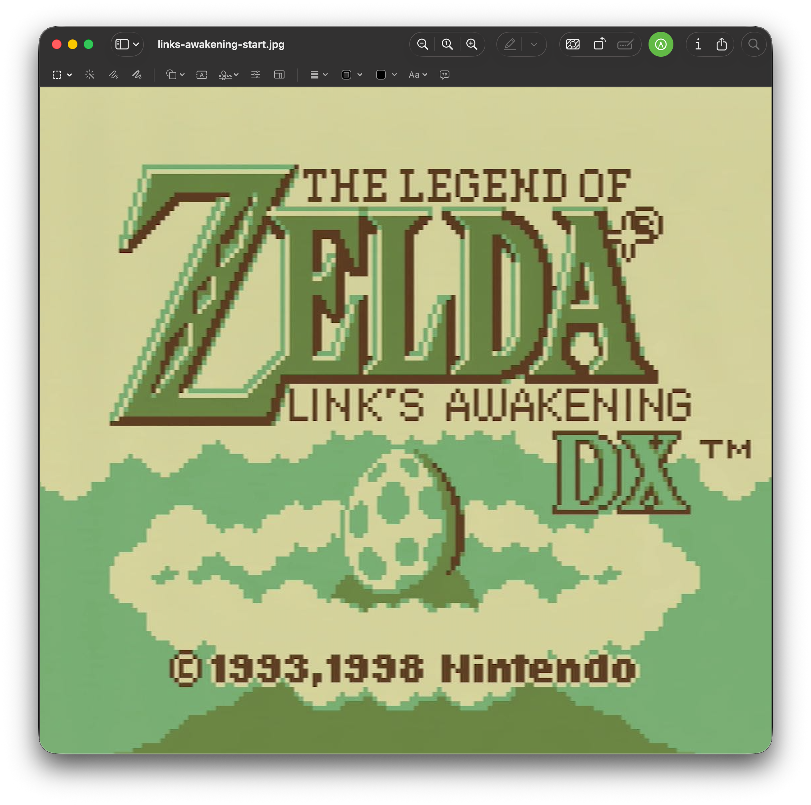
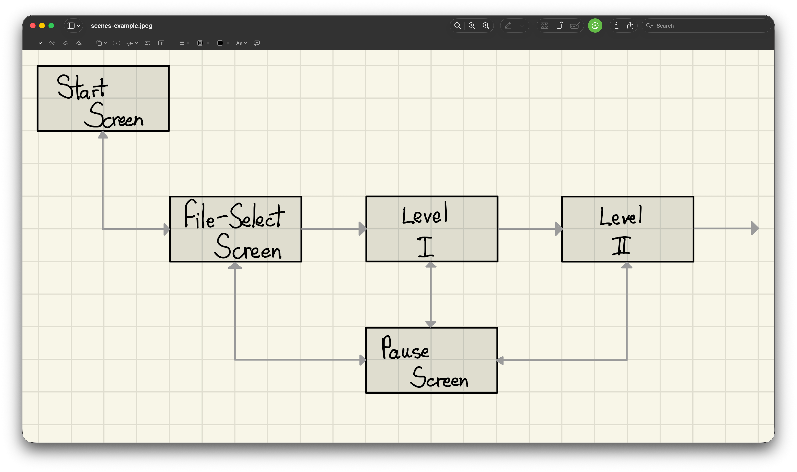
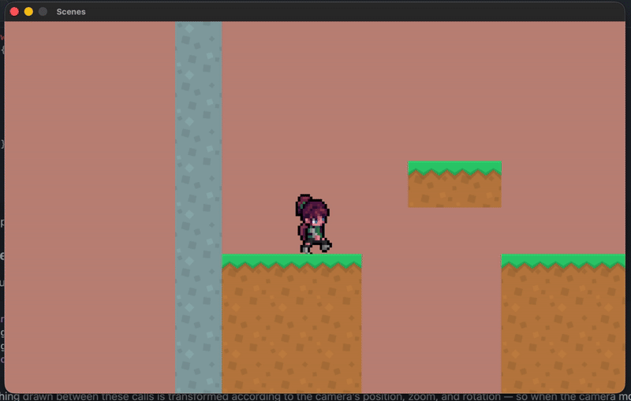

 <h2 align=center>Week 07</h2>

<h1 align=center>Maps</h1>

<h3 align=center>XXXI Wyvern Moon, Imperial Year MMXXV</h3>

<p align=center><strong><em>Song of the day</strong></em>: <em><a href="https://youtu.be/RcDBofJ-_oA?si=KWi3n1zgd1eksZw2"><strong>Bite You</a></strong> by muque (2024)</em></p>

---

## Sections

1. [**Game Scenes**](#1)
2. [**The `Scene` Class**](#2)
    1. [**Attributes**](#2-1)
    2. [**Methods**](#2-2)
3. [**A Sample "Level" Child**](#3)
    1. [**Migrating Values To The Header File**](#3-1)
    2. [**Migrating Functionality To The `LevelA` Class**](#3-2)
    3. [**Cleaning Up `main`**](#3-3)
4. [**Switching Levels**](#4)

---

<a id="1"></a>

## Game Scenes

Let's think about how games present themselves. When you first switch a game on, you are more often than not greeted by a start screen, no?

<a id="fg-1"></a>

<p align=center>
    
    </img>
</p>

<p align=center>
    <sub>
        <strong>Figure I</strong>: Nintendo's Link's Awakening "start scene".
</p>

This is not a level or dungeon of any kind, and yet it is still very much part of the game; in spite of not really being heavy on gameplay, it is considered one of the many **"scenes"** of the game. That is, if we were to think of this in terms of pseudocode, you could say that the game might change from scene to scene constantly depending on the actions of the player:

```
states = { start_screen, save_file_screen, level_1, level_2 }
```

In other words, the player will turn on the game and immediately be taken to the `start_screen` scene and then proceed to the rest of the levels accordingly:

<a id="fg-2"></a>

<p align=center>
    
    </img>
</p>

<p align=center>
    <sub>
        <strong>Figure II</strong>: How our game's scenes might be connected. Think of each of those arrows as pointers, where a player's button press or achievement in-level might trigger our scene to "swap out" for another one (e.g. pressing the <code>Start</code> button would swap out the <code>Level 1</code> scene for the <code>Start Screen</code> screen).</sub>
</p>

Implementing this system is the goal of today's class. We would like our game to be able to switch from scene to scene whenever the player performs certain actions. This, of course, means that we're gonna have ourselves a brand new class.

Yay, encapsulation!

<br>

<a id="2"></a>

## The `Scene` Class

Scenes in games have good amount of variation. For example, the way the "start screen" operates will look drastically different than, say, the way your first level will, or your pause screen, or your tutorial page, etc.. These all however, generally speaking, have three things in common:

<a id="scene-methods"></a>

1. They all have to be loaded (i.e. initialised).
2. Their logic has to be continuously updated.
3. They all have to be drawn onto the screen (i.e. rendered).

The way we're going to adhere to these three points while still achieving a high level of variance is through our good old friend: inheritance. Let's go ahead and define the super class from which all scenes in our game will then inherit:

<a id="2-1"></a>

### The `Scene` Class's Attributes

```cpp
// Scene.h
struct GameState
{
    Entity *xochitl;
    Map *map;

    Music bgm;
    Sound jumpSound;

    Camera2D camera;

    int nextSceneID;
};

class Scene 
{
protected:
    GameState mGameState;
    Vector2 mOrigin;
    const char *mBGColourHexCode = "#000000";

public:
    // ...
};
```

Right away, you'll notice that we've taken our `GameState` struct and moved it into the header file. This is because all of the things belonging to each scene in your game—entities, the camera, the music, etc.—is specific to that scene only. Thus, each scene, regardless of the type of scene it is, will have to have the following:

1. **`GameState mGameState`**: It's own state.
2. **`Vector2 mOrigin`**: It's own notion of what the origin of the window is (although these will, most likely, be the same values throughout a game).
3. **`const char *mBGColourHexCode`**: If you are using assets for your game's background, then you'll probably be ignoring this one, but remember that each scene must be cleared into a colour at the beginning of rendering. I have give it a default value for a black background, but you can change this if you like.

Notice that all of these attributes are _protected_, meaning that they are private except for our child (and hypothetical friend) classes.

<a id="2-2"></a>

### The `Scene` Class's Methods

```cpp
// Scene.h

// ...

class Scene
{
    // ...

public:
    Scene();
    Scene(Vector2 origin, const char *bgHexCode);

    virtual void initialise() = 0;
    virtual void update(float deltaTime) = 0;
    virtual void render() = 0;
    virtual void shutdown() = 0;
    
    GameState   getState()           const { return mGameState;       }
    Vector2     getOrigin()          const { return mOrigin;          }
    const char* getBGColourHexCode() const { return mBGColourHexCode; }
};
```

The constructors are fairly straight-forward: we simply have a default one and a parameterised one:

```cpp
// Scene.cpp
#include "Scene.h"

Scene::Scene() : mOrigin{{}} {}

Scene::Scene(Vector2 origin, const char *bgHexCode) : mOrigin{origin}, mBGColourHexCode {bgHexCode} 
{
    ClearBackground(ColorFromHex(bgHexCode));
}
```

As stated above, the way different types of scenes will operate will vary quite a bit, but they still have to follow [**the same basic structure**](#scene-methods). Thus, we'll delegate this work to our child classes by making our core methods [**virtual**](https://www.learncpp.com/cpp-tutorial/virtual-functions/).

<br>

<a id="3"></a>

## A Sample "Level" Child

In order to create an actual level, you'll want to create a child class to the `Scene` class. Something like this:

```cpp
#include "Scene.h"

class LevelA : public Scene {
    // ...

public:
    LevelA();
    LevelA(Vector2 origin, const char *bgHexCode);
    ~LevelA();
    
    void initialise() override;
    void update(float deltaTime) override;
    void render() override;
    void shutdown() override;
};
```

<a id="3-1"></a>

### Migrating Values To The Header File

What do we actually put into these child classes, though? Well, that depends heavily on the game you're trying to make, but a good starting point is to look at the lines in `main` that go into creating [**our final product from last week**](https://github.com/sebastianromerocruz/CS-3113-Intro-To-Game-Programming/tree/main/lectures/08-maps) (pretty much everything related to the game state):

```cpp
// main.cpp from last week

// ... 

constexpr int   NUMBER_OF_TILES    = 20,
                NUMBER_OF_BLOCKS   = 3;
constexpr float TILE_DIMENSION     = 75.0f,
                END_GAME_THRESHOLD = 800.0f;

constexpr int LEVEL_WIDTH  = 14,
              LEVEL_HEIGHT = 8;
constexpr unsigned int LEVEL_DATA[] = {
   4, 0, 0, 0, 0, 0, 0, 0, 0, 0, 0, 0, 0, 4,
   4, 0, 0, 0, 0, 0, 0, 0, 0, 0, 0, 0, 0, 4,
   4, 0, 0, 0, 0, 0, 0, 0, 0, 0, 0, 0, 0, 4,
   4, 0, 0, 0, 0, 2, 2, 0, 0, 0, 0, 0, 0, 4,
   4, 0, 0, 0, 0, 0, 0, 0, 0, 0, 2, 2, 2, 4,
   4, 2, 2, 2, 0, 0, 0, 2, 2, 2, 3, 3, 3, 4,
   4, 3, 3, 3, 0, 0, 0, 3, 3, 3, 3, 3, 3, 4,
   4, 3, 3, 3, 0, 0, 0, 3, 3, 3, 3, 3, 3, 4
};

// ...

void initialise()
{
    // ...
    gState.bgm = LoadMusicStream("assets/game/04 - Silent Forest.wav");
    SetMusicVolume(gState.bgm, 0.33f);
    // PlayMusicStream(gState.bgm);

    gState.jumpSound = LoadSound("assets/game/Dirt Jump.wav");

    gState.map = new Map(
        LEVEL_WIDTH, LEVEL_HEIGHT,   // map grid cols & rows
        (unsigned int *) LEVEL_DATA, // grid data
        "assets/game/tileset.png",   // texture filepath
        TILE_DIMENSION,              // tile size
        4, 1,                        // texture cols & rows
        ORIGIN                       // in-game origin
    );

    std::map<Direction, std::vector<int>> xochitlAnimationAtlas = {
        {DOWN,  {  0,  1,  2,  3,  4,  5,  6,  7 }},
        {LEFT,  {  8,  9, 10, 11, 12, 13, 14, 15 }},
        {UP,    { 24, 25, 26, 27, 28, 29, 30, 31 }},
        {RIGHT, { 40, 41, 42, 43, 44, 45, 46, 47 }},
    };

    float sizeRatio  = 48.0f / 64.0f;

    gState.xochitl = new Entity(
        {ORIGIN.x - 300.0f, ORIGIN.y - 200.0f}, // position
        {250.0f * sizeRatio, 250.0f},           // scale
        "assets/game/walk.png",                 // texture file address
        ATLAS,                                  // single image or atlas?
        ATLAS_DIMENSIONS,                       // atlas dimensions
        xochitlAnimationAtlas,                  // actual atlas
        PLAYER                                  // entity type
    );

    gState.xochitl->setJumpingPower(550.0f);
    gState.xochitl->setColliderDimensions({
        gState.xochitl->getScale().x / 3.5f,
        gState.xochitl->getScale().y / 3.0f
    });
    gState.xochitl->setAcceleration({0.0f, ACCELERATION_OF_GRAVITY});

    gState.camera = { 0 };                                // zero initialize
    gState.camera.target = gState.xochitl->getPosition(); // camera follows player
    gState.camera.offset = ORIGIN;                        // camera offset to center of screen
    gState.camera.rotation = 0.0f;                        // no rotation
    gState.camera.zoom = 1.0f;                            // default zoom

    // ...
}

void update()
{
    // ...

    while (deltaTime >= FIXED_TIMESTEP)
    {
        UpdateMusicStream(gState.bgm);

        gState.xochitl->update(
            FIXED_TIMESTEP, // delta time / fixed timestep
            nullptr,        // player
            gState.map,     // map
            nullptr,        // collidable entities
            0               // col. entity count
        );

        deltaTime -= FIXED_TIMESTEP;

        Vector2 currentPlayerPosition = { gState.xochitl->getPosition().x, ORIGIN.y };

        panCamera(&gState.camera, &currentPlayerPosition);

        if (gState.xochitl->getPosition().y > 800.0f) gAppStatus = TERMINATED;
    }
}

void render()
{
    // ...

    gState.xochitl->render();
    gState.map->render();

    // ...
}

void shutdown()
{
    delete gState.xochitl;
    delete gState.map;

    UnloadMusicStream(gState.bgm);
    UnloadSound(gState.jumpSound);

    // ...
}
```

I'm gonna first move some of those constants and variables over to the `LevelA` subclass:

```cpp
// LevelA.h

// ...

constexpr int LEVEL_WIDTH = 14,
              LEVEL_HEIGHT = 8;

class LevelA : public Scene {
private:
    unsigned int mLevelData[LEVEL_WIDTH * LEVEL_HEIGHT] = {
        4, 0, 0, 0, 0, 0, 0, 0, 0, 0, 0, 0, 0, 4,
        4, 0, 0, 0, 0, 0, 0, 0, 0, 0, 0, 0, 0, 4,
        4, 0, 0, 0, 0, 0, 0, 0, 0, 0, 0, 0, 0, 4,
        4, 0, 0, 0, 0, 2, 2, 0, 0, 0, 0, 0, 0, 4,
        4, 0, 0, 0, 0, 0, 0, 0, 0, 0, 2, 2, 2, 4,
        4, 2, 2, 2, 0, 0, 0, 2, 2, 2, 3, 3, 3, 4,
        4, 3, 3, 3, 0, 0, 0, 3, 3, 3, 3, 3, 3, 4,
        4, 3, 3, 3, 0, 0, 0, 3, 3, 3, 3, 3, 3, 4
    };

public:
    static constexpr float TILE_DIMENSION       = 75.0f,
                        ACCELERATION_OF_GRAVITY = 981.0f,
                        END_GAME_THRESHOLD      = 800.0f;

    // ...
};
```

<a id="3-2"></a>

## Migrating Functionality To The `LevelA` Class

Since we have a separate initialiser method, there's no need for our constructors to do much:

```cpp
// LevelA.cpp

LevelA::LevelA()                                      : Scene { {0.0f}, nullptr   } {}
LevelA::LevelA(Vector2 origin, const char *bgHexCode) : Scene { origin, bgHexCode } {}

LevelA::~LevelA() { shutdown(); }
```

But our `initialise` method is basically going to receive a copy-and-pasted version of the functionality in `main`'s `initialise`. The big change is that the game state is no longer a global variable (`gState`) but an attribute (`mGameState`):

```cpp
// LevelA.cpp

// ...

void LevelA::initialise()
{
   mGameState.bgm = LoadMusicStream("assets/game/04 - Silent Forest.wav");
   SetMusicVolume(mGameState.bgm, 0.33f);
   // PlayMusicStream(gState.bgm);

   mGameState.jumpSound = LoadSound("assets/game/Dirt Jump.wav");

   mGameState.map = new Map(
      LEVEL_WIDTH, LEVEL_HEIGHT,   // map grid cols & rows
      (unsigned int *) mLevelData, // grid data
      "assets/game/tileset.png",   // texture filepath
      TILE_DIMENSION,              // tile size
      4, 1,                        // texture cols & rows
      mOrigin                      // in-game origin
   );

   std::map<Direction, std::vector<int>> xochitlAnimationAtlas = {
      {DOWN,  {  0,  1,  2,  3,  4,  5,  6,  7 }},
      {LEFT,  {  8,  9, 10, 11, 12, 13, 14, 15 }},
      {UP,    { 24, 25, 26, 27, 28, 29, 30, 31 }},
      {RIGHT, { 40, 41, 42, 43, 44, 45, 46, 47 }},
   };

   float sizeRatio  = 48.0f / 64.0f;

   mGameState.xochitl = new Entity(
      {mOrigin.x - 300.0f, mOrigin.y - 200.0f}, // position
      {250.0f * sizeRatio, 250.0f},             // scale
      "assets/game/walk.png",                   // texture file address
      ATLAS,                                    // single image or atlas?
      { 6, 8 },                                 // atlas dimensions
      xochitlAnimationAtlas,                    // actual atlas
      PLAYER                                    // entity type
   );

   mGameState.xochitl->setJumpingPower(550.0f);
   mGameState.xochitl->setColliderDimensions({
      mGameState.xochitl->getScale().x / 3.5f,
      mGameState.xochitl->getScale().y / 3.0f
   });
   mGameState.xochitl->setAcceleration({0.0f, ACCELERATION_OF_GRAVITY});

   mGameState.camera = { 0 };                                    // zero initialize
   mGameState.camera.target = mGameState.xochitl->getPosition(); // camera follows player
   mGameState.camera.offset = mOrigin;                           // camera offset to center of screen
   mGameState.camera.rotation = 0.0f;                            // no rotation
   mGameState.camera.zoom = 1.0f;                                // default zoom
}

// ...
```

The same goes for `update`, `render` and `shutdown` (note that `panCamera` now resides in `cs3113.h`/`cs3113.cpp`):

```cpp
// LevelA.cpp

// ...

void LevelA::update(float deltaTime)
{
   UpdateMusicStream(mGameState.bgm);

   mGameState.xochitl->update(
      deltaTime,      // delta time / fixed timestep
      nullptr,        // player
      mGameState.map, // map
      nullptr,        // collidable entities
      0               // col. entity count
   );

   Vector2 currentPlayerPosition = { mGameState.xochitl->getPosition().x, mOrigin.y };

   panCamera(&mGameState.camera, &currentPlayerPosition);
}

void LevelA::render()
{
   ClearBackground(ColorFromHex(mBGColourHexCode));

   mGameState.xochitl->render();
   mGameState.map->render();
}

void LevelA::shutdown()
{
   delete mGameState.xochitl;
   delete mGameState.map;

   UnloadMusicStream(mGameState.bgm);
   UnloadSound(mGameState.jumpSound);
}
```

<a id="3-3"></a>

### Cleaning Up `main`

This done, we can _significantly_ clean up our `main` file:

```cpp
// main.cpp
#include "CS3113/LevelA.h"

// ...

LevelA *gLevelA;

// ...

void initialise()
{
    gLevelA = new LevelA(ORIGIN, "#C0897E");
    gLevelA->initialise(); // remember gLevelA is dynamically allocated 
                           // memory so we use arrow operator
}

void processInput() 
{
    gCurrentScene->getState().xochitl->resetMovement();

    if      (IsKeyDown(KEY_A)) gCurrentScene->getState().xochitl->moveLeft();
    else if (IsKeyDown(KEY_D)) gCurrentScene->getState().xochitl->moveRight();

    if (IsKeyPressed(KEY_W) && 
        gCurrentScene->getState().xochitl->isCollidingBottom())
    {
        gCurrentScene->getState().xochitl->jump();
        PlaySound(gCurrentScene->getState().jumpSound);
    }

    if (GetLength(gCurrentScene->getState().xochitl->getMovement()) > 1.0f) 
        gCurrentScene->getState().xochitl->normaliseMovement();

    // ...
}

void update()
{
    // ...

    while (deltaTime >= FIXED_TIMESTEP)
    {
        // Look at how beautiful this is:
        gCurrentScene->update(FIXED_TIMESTEP);
        deltaTime -= FIXED_TIMESTEP;
    }
}

void render()
{
    // ...
    BeginMode2D(gCurrentScene->getState().camera);

    gCurrentScene->render();
    // ...
}

void shutdown()
{
    // ...
    delete gLevelA;
    gLevelA = nullptr;
    // ...
}
```

Running this, we shouldn't see any change whatsoever from [**last class**](https://github.com/sebastianromerocruz/CS-3113-Intro-To-Game-Programming/tree/main/lectures/08-maps#fg-10)—and that is _exactly what we want_: all of the functionality we've implemented thus far nicely packed in a class!

<br>

<a id="4"></a>

## Switching Levels

In a lot of modern engines, such as Unity, scenes are typically placed in a sort of queue that determines its general order. In reality, what we'll care about the most in our engine will be:

1. Which scenes comes first.
2. Which scene each individual scene will switch to when necessary.

Our scene-switching mechanism will be be super simple:

```cpp
// main.cpp

// ...
void switchToScene(Scene *scene)
{   
    gCurrentScene = scene;
    gCurrentScene->initialise();
}
// ...
```

So, if we have two scene types (I created a virtually identical level over at [**`LevelB.h`**](CS3113/LevelB.h)/[**`LevelB.cpp`**](CS3113/LevelB.cpp))), we'd start our game the following way:

```cpp
// main.cpp

// ...

constexpr int NUMBER_OF_LEVELS = 2;

// ...

Scene *gCurrentScene = nullptr;
std::vector<Scene*> gLevels = {};

LevelA *gLevelA = nullptr;
LevelB *gLevelB = nullptr;

// ...

void initialise()
{
    // ...
    gLevelA = new LevelA(ORIGIN, "#C0897E");
    gLevelB = new LevelB(ORIGIN, "#011627");

    gLevels.push_back(gLevelA);
    gLevels.push_back(gLevelB);

    switchToScene(gLevels[0]);
    // ...
}
```

Next, we'll add a new field to our `GameState` struct over in the `Scene` class that will represent the _index_ (within the vector of `Scene` pointers) of the level it should switch after it is "finished":

```cpp
// Scene.h

// ...

struct GameState
{
    // ...

    int nextSceneID;
};

// ...
```

For the sake of simplicity, I'll tell our game to switch levels if Xochitl falls through the pit in level A (a little silly, I know):

```cpp
// LevelA.cpp

// ...

void LevelA::initialise()
{
    // 0 will be our "don't switch scenes yet" state
    mGameState.nextSceneID = 0;

    // ...
}

// ...
void LevelA::update(float deltaTime)
{
    // ...

    // 1 is the index of LevelB in the vector in main.cpp
    if (mGameState.xochitl->getPosition().y > 800.0f) mGameState.nextSceneID = 1;

    // ...
}

// ...
```

Finally, in `main` we'll commit the very rare act of changing our core game-loop to accomodate for these potential scene switches:

```cpp
// main.cpp

// ...

void main()
{
    // ...

    while (gAppStatus == RUNNING)
    {
        processInput();
        update();

        if (gCurrentScene->getState().nextSceneID > 0)
        {
            int id = gCurrentScene->getState().nextSceneID;
            switchToScene(gLevels[id]);
        }

        render();
    }

    // ...
}
```

And we're ready to go!

<a id="fg-3"></a>

<p align=center>
    
    </img>
</p>

<p align=center>
    <sub>
        <strong>Figure III</strong>: Each level has its own separate background colour.</sub>
</p>